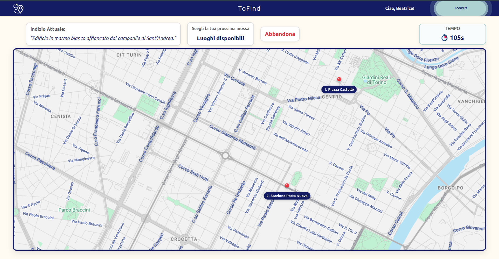
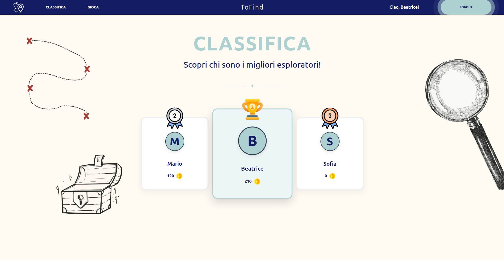

## React Client Application Routes

- Route `/`: Pagina principale. Mostra le istruzioni del gioco per gli utenti anonimi
- Route `/login`: Pagina con il form di autenticazione per l'accesso degli utenti registrati
- Route `/game`: Pagina di gioco. Gestisce il ciclo di vita della partita.
- Route `/leaderboard`: Pagina che mostra la classifica globale degli utenti registrati, ordinata per totale di monete vinte.

## API Server

### Autenticazione
- POST `/api/sessions` 
  - Request body: `{"username": "Mario", "password": "webapp"}`
  - Response: `200 OK` (body: user object pulito) o `401 Unauthorized`
- GET `/api/sessions/current`
  - Response: `200 OK` (body: user object) o `401 Unauthorized`
- DELETE `/api/sessions/current`
  - Response: `200 OK` o `401 Unauthorized` o `500 Internal Server Error`
  
### Gestione Partita
- POST `/api/games`
  - Request body: `{"difficulty": "Facile"}`
  - Response: `201 Created` (body: id, tempo limite, elenco N luoghi, primo indizio) o `401 Unauthorized` o `422 Unprocessable Entity` o `500 Internal Server Error`
- GET `/api/games/:id`
  - Response: `200 OK` (body: game object) o `401 Unauthorized` o `403 Forbidden` o `404 Not Found` o `422 Unprocessable Entity` o `500 Internal Server Error`
- POST `/api/games/:id/answers`
  - Request body: `{"placeId": 3}`
  - Response: `200 OK` (body: outcome CORRECT/WIN/WRONG_ANSWER/TIME_OUT, monete vinte, eventuale indizio successivo o percorso completo) o `401 Unauthorized` o `403 Forbidden` (se partita terminata o di altro utente) o `422 Unprocessable Entity` o `500 Internal Server Error`
  
### Classifica
- GET `/api/leaderboard`
  - Response: `200 OK` (body: array di oggetti { username, total_coins }) o `401 Unauthorized` o `500 Internal Server Error`

## Database Tables

- Table `users`: Contiene le credenziali degli utenti registrati
  - `id` (INTEGER, Primary Key): Identificativo univoco
  - `username` (TEXT, Unique): Nome dell'utente
  - `hash` (TEXT): Password cifrata tramite l'algoritmo scrypt.
  - `salt` (TEXT): Codice crittografico casuale per ogni utente

- Table `places`: Contiene la lista di tutti i luoghi disponibili
  - `id` (INTEGER, Primary Key): Identificativo univoco del luogo.
  - `name` (TEXT, Unique): Nome univoco del luogo  
  - `x, y` (INTEGER): Coordinate percentuali per il posizionamento sulla mappa lato frontend.

- Table `clues`: Contiene uno o più indizi per ogni determinato luogo 
  - `id` (INTEGER, Primary Key): Identificativo univoco dell'indizio
  - `place_id` (INTEGER, Foreign Key): Riferimento al luogo associato
  - `clue_text` (TEXT): Testo descrittivo dell'indizio.

- Table `games`: Contiene lo storico e lo stato delle partite
  - `id` (INTEGER, Primary Key): Identificativo della partita
  - `user_id` (INTEGER, Foreign Key): Collegamento all'utente giocatore.
  - `difficulty` (TEXT): Livello scelto (Facile, Intermedio, Difficile)
  - `treasure_value` (INTEGER): Premio in monete compreso tra 10 e 100 
  - `status` (TEXT): Stato attuale (IN_CORSO, VINTA, PERSA).
  - `current_step` (INTEGER): Indice della tappa attualmente in fase di risoluzione
  - `start_time` (INTEGER): Timestamp di inizio per calcolare la scadenza del tempo.

- Table `game_path`: Contiene il percorso di luoghi ordinato, estratto casualmente per ogni partita
  - `game_id` (INTEGER, Foreign Key): Collegamento alla partita in corso
  - `place_id` (INTEGER, Foreign Key): Luogo previsto per questa tappa.
  - `clue_id` (INTEGER, Foreign Key): Indizio specifico estratto per questo luogo.
  - `step_order` (INTEGER): Posizione ordinale all'interno del percorso (es. 1, 2, 3)

## Main React Components

- `Layout` (in `Layout.jsx`): Componente strutturale globale. Gestisce la NavBar, il testo di benvenuto dell'utente, il bottone di Logout e il blocco della navigazione durante la fase attiva di gioco
- `Home` (in `Home.jsx`): Mostra il contenuto della schermata iniziale. Cambia dinamicamente in base allo stato di autenticazione dell'utente
- `LoginForm` (in `LoginForm.jsx`): Gestisce il modulo di login, gli stati di caricamento e la visualizzazione degli errori di autenticazione.
- `Game` (in `Game.jsx`): Gestisce la partita. Agisce da macchina a stati per gestire le tre fasi del gioco, coordina il timer e le chiamate API per validare le risposte.
- `GameSetup` (in `GameSetup.jsx`): Componente di presentazione per la selezione del livello di difficoltà iniziale.
- `GameEnd` (in `GameEnd.jsx`): Componente che renderizza il riepilogo finale mostrando le monete vinte o svelando l'intero percorso corretto sulla mappa.
- `Leaderboard` (in `Leaderboard.jsx`): Si occupa di recuperare e visualizzare la classifica globale in una tabella formattata.
- `PlacesModal` (in `PlacesModal.jsx`): Modale che permette al giocatore di selezionare la sua prossima mossa, escludendo automaticamente i luoghi già visitati
- `AbandonModal` (in `AbandonModal.jsx`): Modale di conferma per l'abbandono volontario della partita.

## Screenshot

## Users Credentials

- username: `Mario`, password: `webapp`
- username: `Beatrice`, password: `webapp`
- username: `Sofia`, password: `webapp`